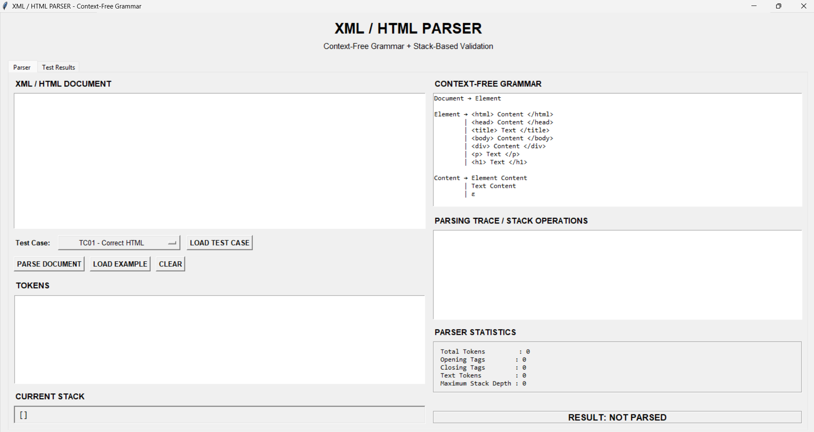
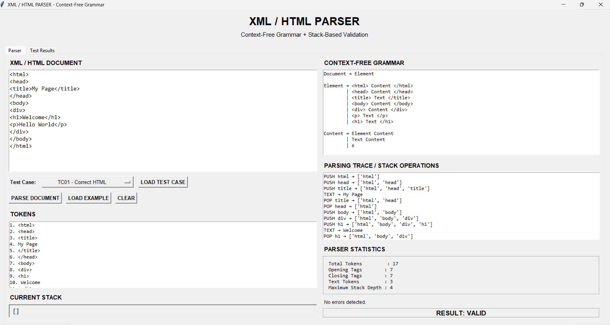
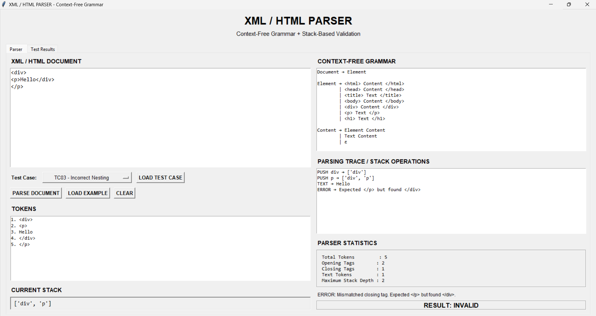
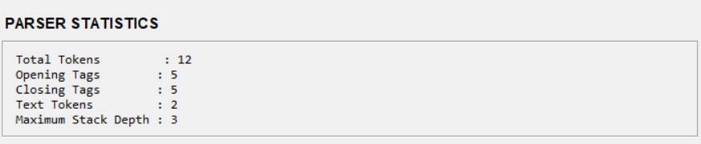
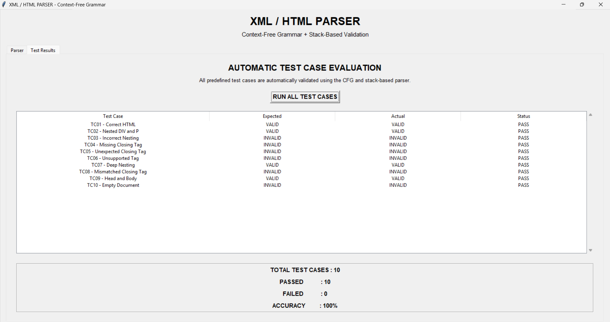

# XML/HTML Parser using Context-Free Grammar

A software-based XML/HTML Parser developed as a Theory of Computation (TOC) case study. The project demonstrates how Context-Free Grammar (CFG) and stack-based parsing can be used to validate the nested structure of XML/HTML documents.

## Project Overview

Markup languages such as XML and HTML use nested tags to organize structured information. A tag must be properly opened and closed, and the nesting order must be maintained.

This project implements a simplified XML/HTML structural parser that:

- Tokenizes XML/HTML input
- Validates supported tags
- Uses a stack to maintain nested tags
- Detects incorrect tag nesting
- Detects missing closing tags
- Detects unexpected closing tags
- Detects unsupported tags
- Displays parsing trace and stack operations
- Calculates parser statistics
- Automatically evaluates predefined test cases

The project is designed for educational demonstration of the relationship between **Context-Free Grammar (CFG)** and **Pushdown Automata (PDA)**.

## Objectives

- To understand the use of Context-Free Grammar for nested structures.
- To implement stack-based tag validation.
- To demonstrate LIFO (Last In, First Out) behavior.
- To identify valid and invalid XML/HTML structures.
- To provide a simple graphical interface for parser demonstration.
- To evaluate the parser using multiple test cases.

## Context-Free Grammar

The simplified grammar used in this project is:

text
Document → Element

Element → <html> Content </html>
        | <head> Content </head>
        | <title> Text </title>
        | <body> Content </body>
        | 
 Content 

        | 
 Text 

        | <h1> Text </h1>

Content → Element Content
        | Text Content
        | ε

Text → text
The grammar represents the nested structure of the supported XML/HTML elements.

Stack-Based Parsing

The parser uses a stack to validate opening and closing tags.

Opening Tag → PUSH
Closing Tag → Compare with Stack Top
Match → POP
Mismatch → ERROR
End + Empty Stack → VALID
End + Non-Empty Stack → INVALID

The stack follows the LIFO (Last In, First Out) principle. Therefore, the most recently opened tag must be closed first.

This demonstrates the stack-based behavior of a Pushdown Automaton (PDA).

Features
Graphical User Interface using Tkinter
XML/HTML input area
Context-Free Grammar display
Token generation
Stack operations
Parsing trace
Error detection
Parser statistics
Predefined test cases
Automatic test case evaluation
VALID / INVALID result display
Technologies Used
Python
Tkinter
Regular Expressions
Context-Free Grammar
Stack Data Structure
Project Structure
XML-HTML-CFG-Parser/
│
├── xml_html_parser.py
├── README.md
├── .gitignore
│
└── screenshots/
    ├── main_gui.png
    ├── valid_parsing.png
    ├── invalid_parsing.png
    ├── statistics.png
    └── test_results.png
How to Run
1. Clone the Repository
git clone https://github.com/YOUR-USERNAME/XML-HTML-CFG-Parser.git
2. Open the Project Folder
cd XML-HTML-CFG-Parser
3. Run the Parser
python xml_html_parser.py

No external Python libraries are required because the project uses Python's built-in modules such as Tkinter and Regular Expressions.

Test Cases

The parser is tested using predefined cases covering:

Correct HTML document
Nested DIV and P tags
Incorrect tag nesting
Missing closing tag
Unexpected closing tag
Unsupported tag
Deep nesting
Mismatched closing tag
Head and Body structure
Empty document
Experimental Results

The parser was evaluated using 10 predefined test cases.

Parameter	Result
Total Test Cases	10
Passed	10
Failed	0
Accuracy	100%

The test cases demonstrate that the parser can identify both valid and invalid nested tag structures according to the simplified grammar.

Error Detection

The parser can detect errors such as:

Unsupported tags
Unexpected closing tags
Mismatched closing tags
Missing closing tags
Empty documents
Incorrect nesting

For example:

Hello

The parser identifies the incorrect nesting because 
 should be closed before 
.

Applications

The concepts demonstrated by this project are useful in:

XML processing
HTML structural validation
Compiler design
Syntax analysis
Parsing systems
Formal language processing
Pushdown Automata concepts
Limitations

This is an educational simplified XML/HTML structural parser. It does not implement the complete XML specification or the complete HTML5 parsing standard.

It focuses mainly on:

Tag structure
Nesting
Stack-based validation
Supported tags
CFG demonstration
Future Scope

The project can be extended by adding:

More XML/HTML tags
XML attributes
Self-closing tags
Comments
More advanced grammar rules
HTML5 parsing rules
Syntax highlighting
File upload and parsing
Export of parsing results
Web-based parser interface
Team

Theory of Computation – CIA Case Study

Developed as a group project for the Theory of Computation subject.

Conclusion

The project demonstrates how Context-Free Grammar and stack-based processing can be applied to validate nested XML/HTML structures. The implementation provides a practical demonstration of parsing, tag matching, error detection, and Pushdown Automata concepts through a graphical interface.

### Automatic Test Results

